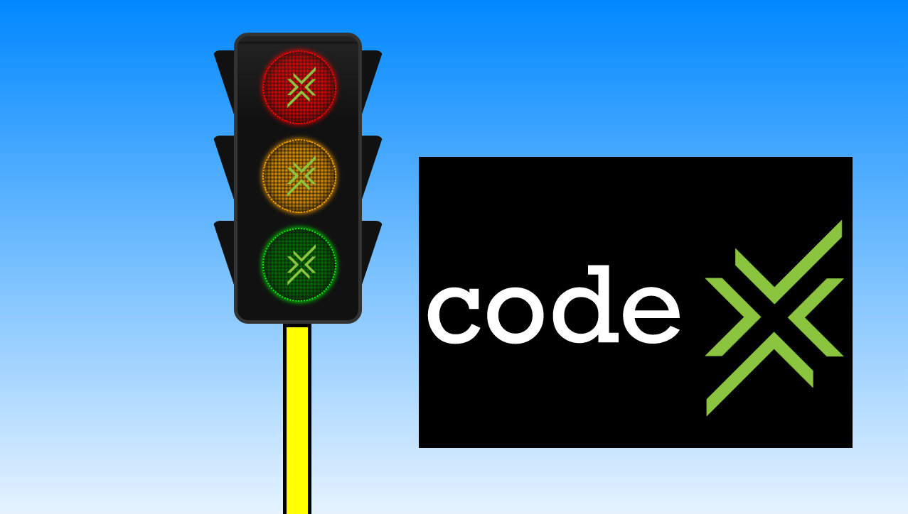
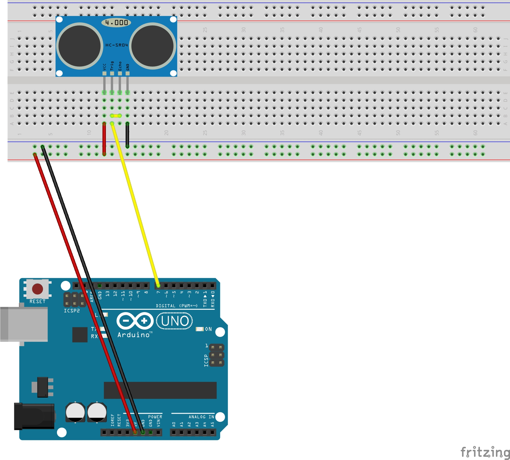

# Robotics
Program created in node.js using modules like [johnny-five](http://johnny-five.io/), [express](https://www.npmjs.com/package/express) and [socket.io](https://www.npmjs.com/package/socket.io). The aim was to simulate a traffic light when an object is a certain distance from a sensor.

# Getting started
* If not already installed, install [node](https://www.digitalocean.com/community/tutorials/how-to-install-node-js-on-ubuntu-16-04).
* Clone this repo and change directory to it in the terminal: `~ $ cd Robotics`.
* Now do `npm install`. This will install all modules used.

# Starting the app
* Run `nodemon app.js` or `node app.js`. You should see a message `App running on http://localhost:2016`
* In the brower type in `localhost:2016`.
* You should see this screen:
* 

 # Setting up hardware
  
